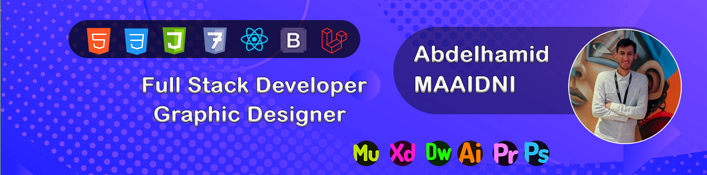
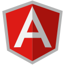

### Hello World ! I'm Abdelhamid 👋

## ✅💡💻 I'm a Software Developer , Born To Be Geek 100% ! ✅💡💻

- 🔑 I’m currently learning **DevOps** 💡
- 📈 2023 Goals: Being the best on what i am doing (**Programing** , **Freelance**) /_ It's my Year _/
- ⚡ logo: **Purpose Never Die <3** 💟
- 👯 I’m always looking to **collaborate with others**

 

### Connect with me:

[][linkedin]

 

## :zap: Github Stats

 

## :zap: Most Used Languages

## :zap: Some Languages and Tools:

   

<!-- Identifiers -->

[linkedin]: https://www.linkedin.com/in/abdelhamid-maaidni-98a5351b0/
